# Interview Coder


A comprehensive interview preparation platform for mastering DSA, Low-Level Design, System Design, and Behavioral interviews.

## Problem

Technical interview preparation is fragmented across multiple tools: LeetCode for coding, Excalidraw for diagrams, ChatGPT for hints, and Anki for spaced repetition. Switching between tools breaks flow and makes it hard to track progress holistically.

Interview Coder consolidates everything into a single platform with integrated code execution, diagram drawing, AI assistance, and spaced repetition review.

## Features

- **Interactive Code Editor** - Write and run TypeScript code with Monaco Editor (VS Code engine)
- **Visual Design Tool** - Draw system architecture diagrams with Excalidraw integration
- **Multi-Provider AI Hints** - Get Socratic guidance without spoilers from OpenAI, Anthropic, Google Gemini, DeepSeek, or local AI tools
- **Spaced Repetition System** - Review concepts using Anki-style flashcards with SM-2 algorithm
- **LeetCode Import** - Fetch problems directly via LeetCode API
- **Progress Tracking** - Monitor completion rates across DSA, LLD, HLD, and Behavioral categories
- **Pattern-Based Learning** - Group problems by algorithmic patterns (sliding window, two pointers, etc.)

## Architecture

```mermaid
graph TB
    subgraph "Frontend - React 19 + Vite"
        A[React Router] --> B[Pages]
        B --> C[Dashboard]
        B --> D[ProblemView]
        B --> E[AnkiReview]
        B --> F[ImportProblem]

        D --> G[Monaco Editor]
        D --> H[Excalidraw]
        D --> I[AI Chat]

        J[Hooks Layer] --> K[useAI]
        J --> L[useCodeExecution]
        J --> M[useSpacedRepetition]
        J --> N[useProgress]

        O[Contexts] --> P[AuthContext]
        O --> Q[CategoryContext]
    end

    subgraph "Local Dev Server - Express"
        R[Local AI API :3456] --> S[claude CLI]
        R --> T[codex CLI]
        R --> U[gemini CLI]
    end

    subgraph "Cloudflare Pages Functions + Turso"
        V[Turso libSQL] --> W[problems]
        V --> X[progress]
        V --> Y[notes]
        V --> Z[spaced_repetition]
        AA[Google One Tap] --> AB[JWT Cookie]
    end

    subgraph "External APIs"
        AC[LeetCode API] --> AD[Problem Import]
        AE[OpenAI API]
        AF[Anthropic API]
        AG[Google Gemini API]
    end

    K --> R
    K --> AE
    K --> AF
    K --> AG

    L --> V
    M --> V
    N --> V
    P --> AA

    F --> AC

    style R fill:#f9f,stroke:#333,stroke-width:2px
    style V fill:#bbf,stroke:#333,stroke-width:2px
    style G fill:#bfb,stroke:#333,stroke-width:2px
    style H fill:#bfb,stroke:#333,stroke-width:2px
```



**Key Components:**

- **Frontend**: React 19 SPA with TailwindCSS, Monaco Editor for code, Excalidraw for diagrams
- **Local Dev Server**: Express local AI server on `:3456` for CLI tools (claude, codex, gemini) to avoid API keys during development
- **Backend**: Cloudflare Pages Functions handle auth, progress, notes, spaced repetition, and AI endpoints
- **Database**: Turso/libSQL stores problems, user progress, notes, and spaced repetition schedules
- **Auth**: Google One Tap posts credentials to `/api/auth/google`; the server issues an httpOnly JWT cookie
- **External Integrations**: LeetCode API for problem import, multiple AI providers for hints

## Run Steps

### Prerequisites

- Node.js 22+
- pnpm
- Cloudflare account for production deploys
- Turso database for production runtime data

### Setup

1. **Clone and install**
   ```bash
   git clone https://github.com/yourusername/interview-coder.git
   cd interview-coder
   pnpm install
   ```

2. **Configure environment**
   ```bash
   cp .env.example .env.local
   ```

   Required build-time value:
   ```bash
   VITE_GOOGLE_CLIENT_ID=your_google_oauth_client_id
   ```

   Required runtime values for Cloudflare Pages Functions:
   ```bash
   GOOGLE_CLIENT_ID=your_google_oauth_client_id
   JWT_SECRET=your_jwt_secret
   TURSO_DATABASE_URL=libsql://...
   TURSO_AUTH_TOKEN=...
   ```

   Optional AI/provider values can be supplied through the UI per request or via server env fallbacks such as `AI_ENDPOINT_URL`, `AI_API_KEY`, and `AI_MODEL`.

3. **Validate local env**
   ```bash
   pnpm validate:env:build
   pnpm validate:env:runtime
   ```

4. **Start development server**
   ```bash
   pnpm dev
   ```

   Opens at `http://localhost:5173` (frontend) and `http://localhost:3456` (local AI server). The first run installs the `server/` submodule dependencies.

### Production Build

```bash
pnpm build
pnpm preview
```

Production deploys through Cloudflare Pages:

```bash
pnpm deploy
```

The deploy path validates env, builds `dist/`, and runs `wrangler pages deploy dist/ --project-name=swe-interview-prep`. GitHub Actions also validates Cloudflare Pages runtime secret names before deploying.

---

**Tech Stack**: React 19, TypeScript, TailwindCSS, Vite, Cloudflare Pages Functions, Turso/libSQL
**License**: MIT
