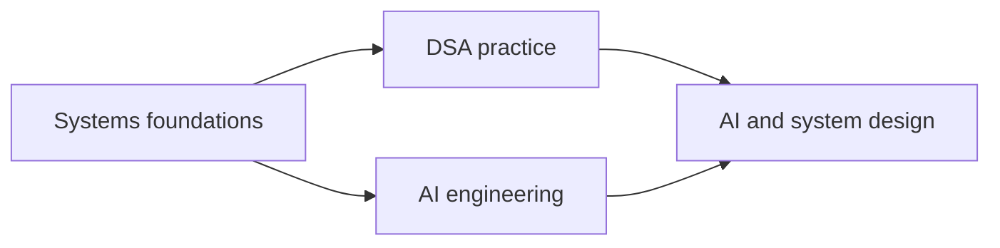

## Context

See `proposal.md` for motivation. The repository already has a canonical
curriculum model, generated JavaScript-independent public pages, roadmap graph
components, and an evidence-gated practice loop. Learn currently offers four
macro doors and the full roadmap catalog, but it does not show the dependency
relationship between the major interview-preparation domains. Curriculum IDs
and generated slugs are compatibility boundaries.

## Goals / Non-Goals

**Goals:**

- Preserve the existing Engineering Workbench visual language and Learn route.
- Express the macro progression in one compact, keyboard-operable component.
- Author new curriculum items through the existing canonical data pipeline.
- Turn a generic synthesis slot into a specific, measurable default project.
- Keep interactive and generated public curriculum representations aligned.

**Non-Goals:**

- Replacing the existing roadmap catalog or roadmap groups.
- Adding a new top-level route, tab, backend API, database table, or dependency.
- Copying the external roadmap's wording, styling, assets, or resource list.
- Expanding DSA, AI, or system-design topic breadth in this change.

## Decisions

### Add an orientation layer rather than another roadmap

The Learn page will render a small macro-path component before the existing
roadmap families. Its four stages link to existing detailed roadmaps, so it
teaches sequencing without creating a twenty-fifth roadmap or duplicating
mastery state. The alternative—another canonical roadmap—would duplicate many
concepts and compete with active-roadmap selection.

### Use a compact semantic flow with ordinary links

The component will use existing tokens, bordered workbench surfaces, concise
monospace stage labels, and visible arrows/labels that are not color-dependent.
On compact screens it becomes one ordered column; at wider widths DSA and AI
sit as parallel stages. Ordinary links preserve keyboard, browser, and screen
reader behavior. A canvas/SVG graph was rejected because the relationship is
small and semantic HTML is easier to operate responsively.

### Add only irreducible missing concepts

Two stable concepts will be added: `data-representation` and
`program-memory-model`. Database fundamentals, operating systems, networking,
concurrency, DSA, AI reliability, and system design already exist and will be
reused. Each new concept receives one executable drill and one review prompt,
then enters the first Systems Foundations milestone.

### Specialize the existing synthesis artifact in place

The `synthesize-systems-foundations-12w` ID remains stable, but its description,
criteria, and deliverables will name the raw-socket HTTP server as the default
project. This strengthens the learning contract without invalidating saved
artifact references. The server may be implemented in C, Rust, Go, or another
language exposing raw TCP sockets; frameworks and high-level HTTP server
libraries are outside the default exercise.

### Regenerate every public derivative from canonical data

The existing curriculum publication scripts will regenerate HTML, Markdown,
JSON, sitemap, and agent catalogs. Integrity tests will assert the new concept
IDs, roadmap placement, practice links, and capstone wording so the application
and public discovery layer cannot drift.

## Risks / Trade-offs

- [The macro path could look like a replacement for the full catalog] → Label it as an orientation map and retain the complete grouped catalog immediately below.
- [Two concepts may grow into survey-course dumping grounds] → Bound them to interview-relevant mental models and require one focused drill each.
- [A raw-socket server is language-dependent] → Specify protocol and evidence requirements while allowing any language with direct socket access.
- [Generated output creates a large mechanical diff] → Change canonical inputs first, regenerate once, and validate one-to-one publication integrity.
- [The AI-engineering stage could overclaim breadth] → Link existing roadmaps and describe evaluation judgment as emphasis, not a new mastery guarantee.

## Migration Plan

No data migration is required. Existing IDs and routes remain stable. Rollback
consists of removing the orientation component and reverting the two added
concept packages and in-place capstone text before regenerating public output.
