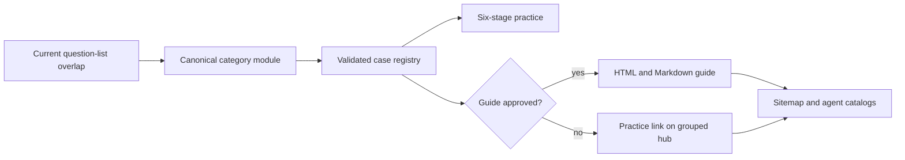

## Context

See `proposal.md` for motivation. The completed first batch already provides a typed case schema, pure staged-session reducer, deterministic and optional-AI evaluation, a responsive practice workspace, and approval-gated public generation. This change is primarily a content and catalog expansion; duplicating any of those mechanisms would create drift.

The existing canonical case module is already large. Twelve new cases and six long guides should not make one file the only editing surface. Generated public pages must still come from canonical case data, and the Socratic no-solutions rule remains unchanged during active attempts.

## Goals / Non-Goals

**Goals:**

- Reuse the exact case/session/evaluation contracts from the first batch.
- Make coverage selection explicit and evidence-based.
- Keep content split into reviewable category modules with one public registry.
- Publish six genuinely useful guides and keep the remainder off the public index until reviewed.
- Preserve deterministic generation and focused integrity checks.

**Non-Goals:**

- Adding a second interview engine, voice interviewer, collaborative whiteboard, or database persistence.
- Claiming company-specific question frequency that cannot be verified.
- Publishing twelve shallow articles merely to increase sitemap size.
- Changing FSRS scoring, Socratic answer policy, or legacy mock behavior.

## Decisions

### 1. Select by cross-list recurrence and pattern coverage

The batch uses overlap across current broad interview-prep lists, then removes cases already represented by URL shortener, chat, feed, recommendation, and rate limiter. The selection deliberately includes product-shaped prompts and infrastructure primitives so practice transfers to unfamiliar variants.

Alternative considered: add every item from one “top 25” list. Rejected because it would overfit one publisher, duplicate existing patterns, and encourage thin content.

### 2. Add a category module behind the existing registry

New definitions will live in a dedicated popular-case module and be appended by the existing `SYSTEM_DESIGN_CASES` export. Consumers continue importing one registry, so session storage and UI routing do not change. Catalog validation remains the boundary that detects duplicate IDs, invalid references, bad weights, or incomplete publication data.

Alternative considered: one file per case. Rejected for this batch because it creates excessive module overhead; category-level separation is enough to keep reviews bounded.

### 3. Reuse the six-stage engine without case-specific UI

Every new prompt maps its unique reasoning into the existing stages. A ticketing case expresses inventory holds in deep dive and oversell in failure; a crawler expresses frontier scheduling in deep dive and crawler traps in failure. No case may add an ad hoc panel or bypass answer hiding.

Alternative considered: custom flows by domain. Rejected because a consistent interview cadence is itself a learned skill and custom reducers would fragment tests.

### 4. Approve six guides, not twelve placeholder pages

The six initial guides span the broadest reusable patterns: media delivery, fan-out, scheduled crawling, synchronized object storage, geospatial matching, and scarce-inventory transactions. The other cases still contain rich in-app review material but their public guide state stays unapproved.

Alternative considered: generate short summaries for every case. Rejected because it weakens learner trust and creates low-value search pages.

### 5. Keep publication derived from canonical approval state

The generator will continue filtering by `publication.state === 'approved'`. Hub grouping, guide routes, catalogs, sitemap URLs, and counts are all computed from that same registry. Integrity tests assert the exact approved set rather than only checking that files exist.

### 6. Source calculations from stable primitives

Guides will cite standards, official platform documentation, and primary engineering material where available. Numeric examples are labeled assumptions and carry units; architectures are sized from those assumptions rather than presenting vendor throughput as universal fact.

Alternative considered: use competitor walkthroughs as technical sources. Rejected; competitor lists justify editorial selection, while technical claims should use authoritative sources.

## Risks / Trade-offs

- **[Large content diff]** → Keep new cases in one separate module, generate artifacts mechanically, and review via catalog/publication tests.
- **[Guide quality varies across six domains]** → Enforce shared required sections, word floor, authoritative-source minimum, calculation anchors, and local SEO checks.
- **[Twenty options overwhelm the selector]** → Group by reusable pattern and show guide/practice badges rather than one flat list.
- **[Popularity claims become stale]** → Record the selection date and sources in the change, but describe the product as “common” rather than exposing unverifiable rankings.
- **[New catalog data breaks saved attempts]** → Keep prior IDs and versions untouched and verify a saved first-batch attempt still parses and resumes.
- **[Generated diff touches all curriculum pages]** → Treat the shared navigation regeneration as expected, inspect representative output, and preserve unrelated working-tree changes.

## Migration Plan

1. Add and validate the new category module without altering prior case definitions.
2. Add grouping metadata and update the selector/hub to consume it.
3. Approve and generate the six complete guides only after their content contract passes.
4. Run focused tests, typecheck, public generation, build, browser checks, and local SEO audit.
5. Leave all changes local for review; deployment and archive remain separate actions.

Rollback is additive: remove the new registry spread and regenerate public artifacts. Existing case IDs, attempts, and routes remain valid.
