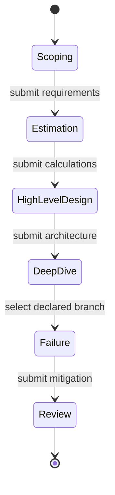
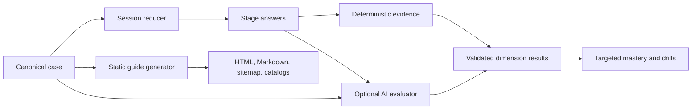

## Context

See `proposal.md` for motivation. The current mock surface stores prompts as a flat array and treats checked rubric rows as both evidence and score. It sends the whole answer and a newline-joined rubric to the generic critique endpoint, then applies one derived rating to every mapped concept. Public pages are generated deterministically from canonical curriculum data, but cases are not part of that projection.

The implementation must preserve the Socratic boundary, work without configured AI, avoid a database migration, and keep static public output deterministic.

## Goals / Non-Goals

**Goals:**

- Make an interview attempt a versioned state machine whose transitions can be unit tested.
- Keep facts, scoring anchors, and branch selection in reviewed case data.
- Produce per-dimension evidence and remediation, with AI as an optional constrained evaluator.
- Reuse approved case data for static study-guide generation without coupling public reading to private attempt state.

**Non-Goals:**

- Voice transcription, live human interview scheduling, or collaborative sessions.
- Universal automatic correctness grading of arbitrary architecture prose.
- Cross-device attempt sync or a D1 schema change.
- Publishing all eight guides before each has passed a separate source and content review.

## Decisions

### Canonical case schema replaces system-design rows only

Introduce a typed, JSON-serializable case catalog for system-design prompts. Technical and behavioral mocks keep the existing lightweight model in this slice. A case includes stable IDs, semantic version, stage prompts, hidden assumptions, rubric dimensions, calculation anchors, deterministic branches, concept remediation, sources, review answer, and publication state.

This incremental split is preferred to forcing coding and behavioral interviews into a state machine designed around system architecture. A single expanded `MockPrompt` was rejected because optional fields would make invalid partial cases easy to ship.

### A pure reducer owns the attempt lifecycle

The UI dispatches events to a pure session reducer; persistence and AI calls stay outside it. The reducer accepts only declared events, records stage submissions, selects case-authored branches, and exposes review material only in terminal review state.

A reducer was chosen over interdependent React state because transition invariants, resumption, and answer visibility need deterministic tests. A backend workflow was rejected for the first slice because the product must work locally and offline.

### Deterministic anchors wrap optional AI evaluation

Rubric dimensions declare positive signals, required concepts, disqualifying misconceptions, score anchors, and remediation targets. The local evaluator produces coverage evidence and a provisional band. If AI is configured, it receives the case/version, submitted stage answers, and declared dimensions, then returns schema-constrained evidence. Invalid or out-of-bounds output is discarded.

This makes AI useful for semantic judgment without letting it invent the exam. Pure self-checking was rejected because it rewards confidence rather than evidence; unconstrained LLM grading was rejected because results would drift across providers and prompts.

### Score dimensions, then map remediation

Overall readiness is derived from weighted dimension scores, but mastery effects are dimension-local. A missed capacity dimension updates only its mapped concepts; a demonstrated dimension is logged as evidence and is not penalized by unrelated misses. Existing review APIs remain the persistence boundary for concept reviews.

Applying the aggregate score to every concept was rejected because it destroys diagnostic precision.

### Persist an append-safe local envelope

Store attempts in local storage as an envelope containing session schema version, case ID/version, immutable submissions, branch history, current state, and optional review result. Parsers validate envelopes before use. Unsupported records remain read-only and can be exported or ignored; they are never silently rewritten.

This avoids a production migration while leaving a clean future sync boundary.

### Static guides are an allow-listed projection

Extend the existing public generator with case hub and guide renderers. A case is emitted only when its publication state is `approved` and all content gates pass. The initial allow-list contains the LLM inference guide. Practice-only cases do not get placeholder URLs.

The guide uses case facts and sources but has editorial fields for narrative transitions and unique explanations. Generating prose mechanically from rubric bullets was rejected because it would create thin, repetitive pages.

## Risks / Trade-offs

- **[Semantic answers cannot be graded perfectly offline]** → Label deterministic results as evidence coverage, constrain AI to declared anchors, and keep the learner-visible evidence inspectable.
- **[One initial guide leaves SEO coverage narrower than the practice library]** → Ship only the strongest page first, measure discovery, and approve later guides in source-reviewed batches.
- **[Case schema may become verbose]** → Provide schema validation and small authoring helpers; prefer explicit reviewed fields over hidden evaluator logic.
- **[Learners can open the public answer mid-attempt]** → Do not link it inside active practice, warn on practice entry from the guide, and treat closed-book integrity as a learner choice rather than pretending client-side secrecy is enforceable.
- **[Illustrative hardware math can age quickly]** → Make workload variables and measured benchmark inputs explicit; teach the sizing equation rather than canonizing a GPU count.

## Migration Plan

1. Add and validate the canonical case schema and eight practice cases without changing current routes.
2. Add the reducer, persistence envelope, evaluators, and focused unit tests.
3. Route system-design selections through the staged UI while leaving technical and behavioral mocks unchanged.
4. Add targeted remediation and validated optional AI results.
5. Add the approved public hub and flagship guide projection, then run public-integrity, docs, type, unit, and build checks.
6. Keep the old system-design rows readable for one release only if saved deep links require them; remove duplicate rows once compatibility tests pass.

Rollback is a code rollback plus regeneration of static output. Local attempt envelopes remain inert if the reader is absent and are not deleted.
