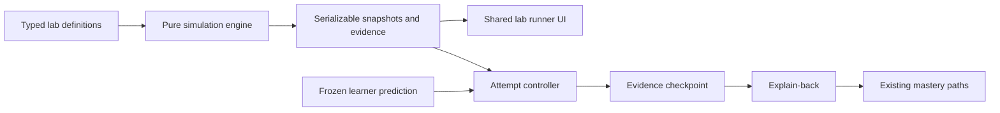

## Context

The product already has the right learning shell: typed React routes, concept
and roadmap data, guest-scoped local state, Monaco/Excalidraw workspaces,
objective drill gates, Feynman explanation grading, and FSRS concept mastery.
It does not have a runtime for manipulating systems behavior. The current
Playground executes code and renders diagrams; it cannot express multiple
independent truth planes such as an Argo Application health badge, a sync
operation, a failed hook, and still-running previous workloads.

The requested environment is explicitly an imitation. Its value is safe,
repeatable causal exploration, not production verification. It must therefore
be clearer than a live cluster while remaining honest about which behaviors are
modeled.

The visual work is classified as **preserve**: use the current page shell,
cards, controls, typography, focus behavior, and responsive conventions. Do not
rename the repository or product, alter the primary navigation, or introduce a
new visual language.

## Goals / Non-Goals

**Goals:**

- Establish a reusable deterministic simulation runtime rather than three
  bespoke interactive pages.
- Make asynchronous order, controller ownership, branch decisions, and
  misleading aggregate state visible.
- Ship deep GitOps/migration, tracing/sampling, and metrics/discovery labs.
- Require prediction and decisive evidence before an attempt can affect
  learning progress.
- Reuse current account scoping, Feynman/understanding patterns, concept
  mastery, and responsive primitives.
- Keep lab definitions straightforward enough to review against pinned source
  before adding them.

**Non-Goals:**

- Connecting the browser to Kubernetes, Docker, Git, GCP, Prometheus, the local
  platform lab, or a user machine.
- Claiming behavioral parity with GKE Autopilot, Cloud Trace, Managed
  Prometheus, Cloud Logging, or a specific production cluster.
- Replacing Playground, Build Lab, diagrams, drills, or the real local
  integration lab.
- Adding new concepts, a database table, API action, package, primary
  navigation tab, or production dependency in the first release.
- Persisting free-form guest explanations.

## Decisions

### Use a pure virtual-time transition engine

The engine receives an immutable `LabDefinition`, a selected scenario and
control values, and an ordered learner action (`start`, `step`, `advance`,
`finish`, `reset`). It returns a new serializable snapshot. No wall-clock timer,
randomness, network request, browser environment value, or component state
participates in transition logic.

```ts
type SimulationSnapshot = {
  labVersion: number;
  tick: number;
  phase: 'ready' | 'running' | 'blocked' | 'failed' | 'complete';
  actors: Record<string, ActorState>;
  events: SimulationEvent[];
  evidence: EvidenceRecord[];
  availableActions: SimulationAction[];
};
```

Virtual ticks express causality without slow animation. The UI can animate a
transition for presentation, but reduced-motion users and tests receive the
same snapshot immediately.

Alternative considered: one React state machine per lab. Rejected because
behavior would be coupled to presentation, authoring a fourth lab would require
new code, and cross-lab invariants could not be validated centrally.

### Make definitions declarative, but transitions typed

Definitions under `src/data/systems-labs/` own metadata, actors, controls,
states, evidence records, prediction choices, and expected checkpoints. Shared
transition primitives under `src/lib/simulation/` cover queues, health
aggregation, retry/backoff, branching, and evidence emission. A definition may
compose primitives but may not execute arbitrary strings.

The registry validates:

- unique lab, actor, state, event, and evidence IDs;
- known concept IDs;
- valid transition targets;
- reachable terminal outcomes;
- prediction answers backed by evidence IDs;
- scenario expectations matching a deterministic completed snapshot.

Alternative considered: JSON-only definitions. Rejected because typed
composition and exhaustive unions provide stronger review and refactoring
safety than a runtime schema alone. Definitions remain data-oriented TypeScript
with no React imports.

### Pin source contracts without adding upstream runtimes to the browser

Each lab declares a fidelity level and immutable provenance records containing
the upstream repository, full commit SHA, reviewed paths, license, method, and
date. Small checked-in source contracts assert observable model consequences.
Deliberately incorrect mutations prove those contracts can fail.

`source-verified` means a rule was reviewed against pinned source or an
upstream test vector. `oracle-verified` is reserved for a later local/CI tool
that executes the upstream implementation; definition validation rejects that
claim without an executable-oracle record.

Alternative considered: import Argo, Kubernetes, ESO, OTel, or GMP runtimes
into the SPA. Rejected because it would add privilege, size, version coupling,
and false parity to a deliberately disconnected learning surface.

### Share deterministic actions, never mastery

A replay contains only a schema version, lab and definition identity, scenario,
ordered reducer actions, and a fingerprint of the resulting snapshot. Imports
validate every field and recompute the fingerprint. Imported runs are
observation-only; a learner must still freeze their own prediction and explain
the outcome before mastery is eligible.

### Make setup an editable repair task

Each lab owns a typed configuration challenge containing one or more files, a
visible delivery brief, stable tutorial comment markers, expected
configuration lines, causal hints, and successful evidence. The shared
workshop finds the line immediately following each marker and compares its
normalized content with the contract.

This is intentionally a bounded configuration exercise rather than a general
YAML interpreter. It accepts realistic Kubernetes, OpenTelemetry, Collector,
and PromQL fragments while avoiding a new parser dependency or claims that the
browser executed those files. Every starter is tested to fail, a repaired
fixture must pass, and mutating one repaired line must fail the matching
contract.

Verified files are stored with the account-scoped attempt. Editing or resetting
them invalidates the configuration gate. A completed simulation is insufficient
for authenticated explanation grading until the Build mode evidence exists.

### Separate the engine, learning controller, and UI



- `src/lib/simulation/`: types, reducer, transition primitives, validation.
- `src/data/systems-labs/`: catalog and the three initial definitions.
- `src/hooks/useSimulationAttempt.ts`: prediction freezing, attempt lifecycle,
  per-account local persistence, and mastery eligibility.
- `src/pages/SystemsLabs.tsx`: catalog.
- `src/pages/SystemsLab.tsx`: shared runner route.
- `src/components/simulation/`: controls, actor graph, event timeline, evidence
  inspector, prediction and checkpoint panels.

React components render snapshots and dispatch actions; they never decide what
the simulated system does.

### Model truth planes as evidence owned by actors

Every visible status has:

- an owning actor;
- a plane such as `resource`, `controller`, `operation`, `process`, `storage`,
  or `user-visible`;
- a synthetic source label and value;
- the tick at which it became available;
- an explanation shown only after reveal.

Summary badges are projections over these records, not an independent source of
truth. This permits the GitOps lab to render `Application health: Healthy`,
`Sync: OutOfSync`, and `Hook: Failed` simultaneously without special-case UI.

Alternative considered: a single success/failure pipeline. Rejected because it
would erase the exact contradictions the lab is intended to teach.

### Freeze predictions before revealing decisive evidence

A scored attempt has two layers:

1. `AttemptDraft`: scenario, controls, prediction and rationale; editable.
2. `FrozenAttempt`: immutable prediction plus lab definition version; created
   when execution starts.

Free exploration bypasses freezing but is never mastery-eligible. A retry
creates a new attempt ID so previously revealed evidence cannot be rewritten
into a correct historical prediction.

Only compact structured attempt state is stored under a new account-scoped
local key. Free-form explanation text is not retained locally. A definition
version mismatch preserves the historical result summary but requires a new run
before scoring.

### Reuse objective and explain-back paths without fabricating guest mastery

The attempt controller first grades deterministic prediction and
evidence-selection checkpoints. It then builds an explain-back prompt from the
scenario, frozen prediction, final snapshot and decisive evidence.

For signed-in learners, the existing Feynman grading path is generalized to
accept a systems-lab artifact payload in addition to code. Its returned concept
ratings continue through the existing concept mastery authority.

For guests, the completed attempt is stored locally but positive mastery stays
pending because the authenticated Feynman path is unavailable. The UI can
offer the current public understanding-check mechanism when AI is configured,
but the first release does not introduce a second durable grading authority or
pretend that a minimum-length explanation is proof.

Alternative considered: award guest mastery from prediction correctness alone.
Rejected because guessing the final state does not demonstrate causal
understanding and would violate the product's evidence standard.

### Map to existing concepts first

Initial lab mappings use existing broad concepts:

- GitOps/migrations: `containers-kubernetes`,
  `infrastructure-automation`.
- Tracing/sampling: `monitoring-analytics`, `tracing-replay`.
- Metrics/discovery: `monitoring-analytics`, `containers-kubernetes`.

The lab itself records finer checkpoint completion locally. Adding granular
Argo, ESO, migration-safety, OpenTelemetry and Prometheus concepts would expand
the canonical curriculum and all generated public surfaces, so it is a
separate, reviewable curriculum change.

### Preserve routes and navigation

Add lazy routes `/labs` and `/labs/:labId`. Entry points appear contextually on
Learn, relevant concept detail pages and Build Lab. `PRIMARY_NAV` and all
existing labels remain unchanged in the first release.

Unknown lab IDs render the existing not-found/empty-state pattern. Scenario IDs
may be selected by query parameter for stable learning links, but runtime state
is never encoded into a URL.

## Risks / Trade-offs

- **Modeled behavior drifts from pinned source** → Store a source/version note
  with every lab, require scenario assertions, and treat definition updates as
  reviewable content changes.
- **A polished animation is mistaken for verification** → Label every runner
  as a deterministic simulation and keep real-environment verification as an
  explicit external next step.
- **Learners memorize positions rather than causality** → Freeze predictions,
  vary controls, require decisive evidence, and use explain-back prompts.
- **The runner becomes an unreadable dashboard** → Show one current snapshot,
  one ordered event/evidence inspector, and progressive disclosure rather than
  every panel simultaneously.
- **Broad concept IDs over-credit mastery** → Require Feynman grading for
  positive mastery and keep lab-specific completion distinct until granular
  curriculum concepts are separately approved.
- **State definitions become a second programming language** → Keep a small
  typed primitive set and prefer explicit transitions over generic expression
  evaluation.
- **Existing active OpenSpec work overlaps navigation** → Do not modify primary
  navigation or the unfinished Sweep decisions; contextual links are additive.
- **Guest and authenticated behavior diverge** → Test both explicitly and do
  not promise cross-device attempt history in the first release.

## Migration Plan

1. Add and test engine types, reducer, validation and one minimal fixture
   without exposing a route.
2. Add the shared catalog and runner using the preserve design lane.
3. Implement the three definitions and their scenario assertion suites.
4. Add prediction, evidence checkpoint, local attempt state and explain-back
   integration.
5. Add lazy routes and contextual entry points.
6. Verify unit tests, typecheck, lint, build, guest behavior, keyboard behavior,
   and browser layouts at 390, 768 and 1440 pixels.

Rollback removes the two additive routes, contextual links, lab definitions
and simulation modules. No database, API, generated curriculum or existing
stored state requires migration; an unused namespaced localStorage entry is
safe to ignore.

## Open Questions

- Should a later curriculum change add granular concepts for Argo CD hooks,
  ESO reconciliation, migration safety, OpenTelemetry sampling and metrics
  discovery, or should these remain checkpoints under broad concepts?
- After the first three labs prove useful, should Systems Lab earn a primary
  navigation entry? That decision intentionally remains outside this change.
- Should a later optional adapter launch or inspect the separate local
  integration lab? Any such bridge requires a distinct security and product
  proposal.
