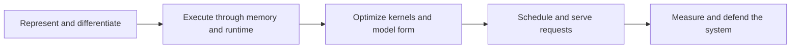

## Context

The canonical curriculum already contains the necessary machine, model-training, and inference-serving concepts, drills, and public generation pipeline. See `proposal.md` for motivation. Roadmaps are canonical JSON records grouped for discovery in application code; generated public files are checked in and regenerated during builds.

## Goals / Non-Goals

**Goals:**

- Create a short causal bridge across three existing curriculum domains.
- Preserve stable concept IDs and reuse their practice material.
- Make completion depend on measurable evidence rather than passive reading.
- Keep the interactive and public curriculum projections aligned.

**Non-Goals:**

- Import AISystem prose, diagrams, slides, binaries, or repository assets.
- Add a new track, API, database model, runtime dependency, or bespoke page type.
- Attempt comprehensive AI-chip, compiler, or framework coverage.

## Decisions

### Represent the feature as a canonical roadmap

The synthesis will use the existing roadmap schema, detail page, progress model, and public generator. A custom page would duplicate routing, selection, and publication behavior; adding the material to a specialist roadmap would hide the cross-layer causal sequence.

### Reuse concepts and drills, add one dedicated artifact

The roadmap will reference stable concepts spanning representation, backpropagation, memory hierarchy, performance, kernels, quantization, batching, hardware, and serving economics. One new artifact will define the integrated evidence contract. This avoids shallow duplicate concepts and keeps the change maintenance-friendly.

### Organize milestones by the execution path

The sequence is:

This differs from topic-based grouping by making every later optimization explainable in terms of work introduced by an earlier layer.

### Derive all public output from existing generators

No generated file will be hand-edited. Updating canonical data and running the repository build/generation scripts will update counts, catalogs, sitemap entries, and the new public roadmap page deterministically.

## Risks / Trade-offs

- [The path may repeat concepts found in longer roadmaps] → Label it as synthesis and keep it short, with a distinct integrated capstone.
- [A broad capstone could accept hand-wavy evidence] → Require a reproducible workload or model, before/after measurements, a bottleneck diagnosis, and an explicit trade-off.
- [Generated output creates a large diff] → Use the existing generator and review the changed-file set for only expected count, catalog, sitemap, and roadmap-page updates.
- [Hardware and framework details age quickly] → Reuse mechanism-focused concepts and primary sources instead of vendor survey content.

## Migration Plan

1. Add the canonical roadmap, artifact links, discovery entry, and focused tests.
2. Regenerate public curriculum output and run integrity checks.
3. Deploy through the existing manual release workflow.
4. Roll back by reverting the release commit; no persisted user data or schema migration is involved.
