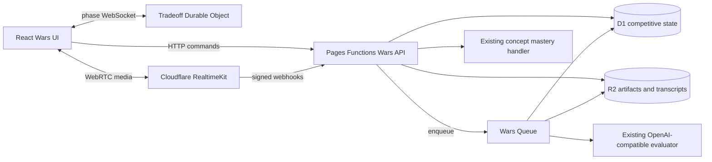
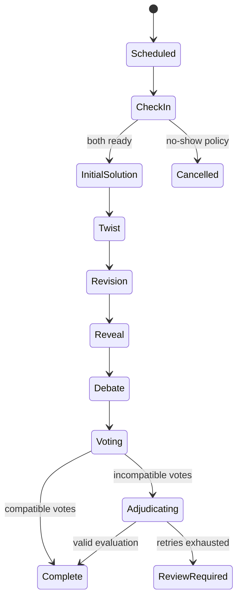

## Context

See `proposal.md` for motivation and the five capability specs for behavior.

The current product is a React SPA on Cloudflare Pages with one catch-all Pages Function, native D1, authenticated concept mastery, and local-first guest state. Mock prompts already map attempts to concepts and FSRS. The existing `user_elo_state` is client-writable per-roadmap drill calibration, so it is not a trustworthy base for public competitive rating. Monaco, Excalidraw, the shared workbench UI, PostHog, and the OpenAI-compatible AI adapter are reusable.

Software Wars adds four architectural concerns the repository does not currently have: server-only ranked content, immutable competitive transactions, live room coordination, and managed WebRTC media. Schema changes must remain additive, provider and signing secrets cannot enter the repository, production deployment remains manual, and the accepted Socratic no-solutions ADR remains unchanged.

## Goals / Non-Goals

**Goals:**

- Make both game modes usable end-to-end behind an operator-controlled launch state.
- Keep competitive truth server-owned, versioned, idempotent, and auditable.
- Reuse the existing learning system for remediation without conflating adaptive drill Elo with competitive Elo.
- Keep live game state independent from the media provider.
- Preserve the established Engineering Workbench UI and keep Wars contextual rather than adding a seventh primary navigation item.
- Make local and CI verification possible without Cloudflare credentials or live media.

**Non-Goals:**

- Synchronous live matchmaking for Blitz.
- Unrestricted AI-generated ranked content.
- Automated production provisioning, migration, deployment, or secret writes.
- Native mobile applications, tournaments, payments, recruiter surfaces, or sophisticated anti-cheat.
- Collaborative multi-writer editing; Tradeoff artifacts are private until immutable reveal.
- Video recording by default.

## Decisions

### 1. Split the control plane, media plane, and asynchronous evaluation plane

The SPA talks to Pages Functions for durable commands, to a match-specific Durable Object WebSocket for live Tradeoff coordination, and to RealtimeKit for audio/video. Adjudication and transcript ingestion use a Queue consumer so external model or download failures can retry without blocking a request.

The Durable Object is not used as the permanent match database. It owns live serialization and recovers durable phase state from its storage; finalized match truth is projected into D1. RealtimeKit never decides the phase, winner, or rating.

**Alternatives considered:** raw WebRTC would require signaling, TURN, device recovery, and media observability; Realtime SFU would still require substantially more custom media code; D1 polling would work at two participants but weaken synchronized twist/vote behavior and produce avoidable request load.

### 2. Add a dedicated Wars API route family

The Pages catch-all adds `/api/wars/*` routing with explicit public and authenticated endpoints. Competitive writes do not enter `/api/learning?action=...`, whose registry remains focused on learning state.

Representative route groups:

- public: launch status, sanitized leaderboards, public results, challenge previews;
- authenticated: match creation/resume, answer submission, challenge creation/acceptance, history, reports, Tradeoff scheduling, drafts, votes, media token issuance;
- provider: signed RealtimeKit webhooks;
- operator-only: content status/report review and rating correction operations.

Every mutating request uses an idempotency key or a natural unique constraint. Responses return opaque identifiers, never answer-bank internals or provider administrative tokens.

**Alternative considered:** add many learning actions. Rejected because route authorization, provider webhooks, and public share reads do not fit that dispatcher cleanly.

### 3. Use normalized additive competitive tables and immutable event rows

Migration `0002_software_wars.sql` adds tables grouped by responsibility:

- content snapshots: `war_content_versions`, `war_ai_opponents`, `war_ai_answers`, `war_content_reports`;
- matches: `war_matches`, `war_participants`, `war_attempts`, `war_answers`, `war_artifacts`, `war_votes`, `war_evaluations`, `war_challenges`;
- ratings: `war_ratings`, `war_rating_events`;
- learning: `war_remediation_events`.

Rows use text IDs, foreign keys, timestamps, explicit status constraints, and unique keys for idempotency. A match snapshots content version IDs, rules version, rating snapshots, and opponent profile version before play. Rating events and finalized results are append-only; corrections use compensating events.

Large Excalidraw documents, optional media exports, and transcripts live in R2 under opaque match-scoped keys with hashes stored in D1. Small text/code artifacts may remain inline up to a documented size limit.

**Alternatives considered:** extending `user_elo_state` would permit client-authored ratings and opaque overwrites; storing every match as JSON would make idempotency, leaderboard queries, and corrections fragile.

### 4. Keep ranked content server-only, concept-owned, and validate it deterministically

Authoring sources live under a non-client `shared/data/software-wars/` tree. A repo script validates schema, source URLs, concept IDs, unique IDs/versions, answer defensibility fields, option uniqueness, deterministic variants, AI answer coverage, status transitions, and launch thresholds. The build imports a compact server bundle; client code never imports the source modules.

Every Blitz question owns one `primaryConceptId` that resolves to the canonical Learning OS concept catalogue and may name supporting `conceptIds`. Track and roadmap membership is derived from canonical concept tags and roadmap milestones; it is never hand-maintained on the question. The production gate requires reviewed active depth across the curriculum rather than only the former 12 backend/system topics. Generated variants never increase the distinct-question count and are reported separately. Every option carries an authored explanation, allowing results to explain both why the key is correct and why each distractor is wrong. Development and unranked preview can run below ranked thresholds. Content is activated by checked-in status, not runtime AI generation.

The server exposes an answer-safe curriculum coverage manifest containing canonical track, roadmap, and concept identity plus active/candidate question counts. The client uses that manifest for search and queue selection. A scoped practice match snapshots `{queueType, queueId}` and resolves eligible questions server-side. Ranked Mix remains the only global Elo queue; track, roadmap, and concept queues are diagnostic until a future rating policy explicitly changes that.

Topic-owned bank modules replace the former single monolithic file. A duplicate detector rejects repeated IDs, normalized stems, identical option sets, and near-duplicate question pairs above a conservative similarity threshold. Coverage reports expose distinct base questions, playable versions/variants, options with explanations, concepts, topics, difficulties, and AI answer coverage as separate counts.

Parameterized questions expose a generator ID and seed in the match snapshot. Generation is pure and validated by exhaustive or bounded parameter-domain tests. Post-match explanations are authored content and do not change the Socratic companion.

**Alternative considered:** putting content in `src/data` would ship answers in the public JavaScript bundle. Storing authoring content only in D1 would make review history and deterministic CI validation harder.

### 5. Use classic versioned Elo with distinct mode state

Competitive ratings start at 1500. Matches 1–10 use K=48; later matches use K=24. The score is 1, 0.5, or 0. The implementation is a pure shared server module with an explicit algorithm version and rounding rule, exercised by fixtures.

Human pairings produce reciprocal events once. AI profiles have fixed benchmark ratings and never receive per-match mutations. Ranked ghost attempts can be paired only once. Ranked Mix is the only Blitz queue that affects the global Blitz rating; topic queues are diagnostic practice.

**Alternatives considered:** Glicko models uncertainty better but contradicts the explicit Elo product language and increases explanation complexity; one combined mode rating would compare unrelated skills.

### 6. Model live Tradeoff progression as an explicit state machine

The server stores absolute phase deadlines. Clients render countdowns from `phaseEndsAt` and resynchronize on visibility change, reconnect, and mutations. DO alarms advance phases and WebSocket messages broadcast transitions; every mutation still checks the stored deadline so a delayed alarm cannot accept late work.

Pages issues a short-lived match-scoped realtime token signed with a dedicated secret shared only by Pages and the Wars Worker. The Worker validates membership claims and never accepts a client-supplied user identity.

### 7. Wrap RealtimeKit behind a media provider contract

The frontend exposes battle-specific camera tiles and controls using the official RealtimeKit Core and React lifecycle packages rather than rendering the generic full-screen meeting. A backend provider module owns meeting creation, participant enrollment/token refresh, transcription request state, and webhook verification.

Required non-secret configuration is account ID and RealtimeKit app ID. Administrative API token and webhook verification material remain platform secrets. Media rooms are created near check-in, not at scheduling time. Post-meeting transcription is opt-in per match; video recording is off by default. Transcript webhooks enqueue copying into project-owned R2 before provider expiry.

The provider contract has a disabled adapter used in local development and deployments without configuration. This keeps artifact/state testing functional and provides a migration path to LiveKit Cloud if RealtimeKit beta constraints become unacceptable.

**Alternative considered:** bind RealtimeKit calls directly into React pages. Rejected because it would leak lifecycle logic throughout UI and make beta-provider replacement expensive.

### 8. Reuse current AI and FSRS paths conservatively

The queue consumer calls the existing OpenAI-compatible generation layer with a Tradeoff-only structured evaluation prompt and validates its JSON against the match rubric. It does not use or modify the Socratic chat system prompt.

Blitz misses create idempotent `again`/`hard` remediation events and then call the existing authenticated concept review logic. Correct MCQs produce diagnostic success only. Tradeoff evaluations may create `good` evidence only when the frozen artifact and rubric explicitly support it; they never create `easy` automatically.

### 9. Preserve the current visual system and route hierarchy

The design lane is `preserve`. `/wars` is a contextual competitive hub with mode cards, ratings, recent history, and leaderboards. Battle routes use existing `PageShell`, `Card`, `Button`, `FilterPill`, typography, black canvas, sparse sky signal, and semantic status colors.

Blitz focuses on one question and one irreversible next action. Tradeoff uses a wide workbench: compact media rail, prompt/twist/status strip, artifact editor, and phase controls. At compact widths it stacks in semantic order, keeps 44px controls, and supports reduced motion. Today and Mock link into Wars; the six primary tabs remain unchanged.

### 10. Build test seams before provider integration

Pure modules own selection policy, scoring, Elo, phase transitions, vote compatibility, remediation mapping, and content validation. API handler tests use an in-memory database adapter pattern already present in the repo. UI tests mock Wars API/provider hooks. Playwright uses two browser contexts and fake media where supported; live RealtimeKit smoke remains an explicit operator check.

### 11. Treat Solo Tradeoff as an ephemeral browser-to-provider session

Solo Tradeoff reuses the local 30-minute phase UI but does not impersonate a ranked match. The learner explicitly supplies an OpenAI-compatible endpoint, API key, and model. A small client adapter calls that endpoint directly so the Learning OS backend never receives the credential. Configuration, opponent artifacts, debate messages, and feedback live only in React memory and are discarded on reload; the existing non-secret learner draft may continue using local preview storage.

The AI produces its initial artifact before entry. On twist reveal it receives only the original prompt, twist, and its own artifact, preserving an independent comparison. Only after artifacts freeze may debate turns include the learner's revealed draft. Final feedback is rubric-oriented coaching plus a comparative outcome, never competitive Elo, FSRS mastery, public history, or an authoritative human-equivalent judgment.

Custom endpoints are an explicit trust choice: the UI states that the key is sent directly to the selected provider. No provider URL, model, key, prompt, artifact, response, or transcript enters analytics. Browser CORS/provider failures degrade to the existing local workbench without losing the learner's draft.

### 12. Make Wars guest-first and compose Tradeoff from Playground tools

Authentication is not a play gate. Guests can always start the local unranked Blitz loop and the local or BYOK Solo Tradeoff loop. The authenticated server path remains the upgrade boundary for ranked Elo, durable history, human ghost/challenge identity, shareable server results, remediation writes, and cross-device recovery. Guest UI must describe that upgrade without replacing Play with Sign in.

Tradeoff imports the same controlled Monaco and Excalidraw components used by Playground. A small Tradeoff workspace composes design notes, code/pseudocode, and diagram state; on desktop code and diagram share the canvas, while compact layouts switch one full-width tool at a time. Tradeoff owns the state adapter: guest drafts may use the existing preview key, live drafts save artifact types through the Wars API, and all editing surfaces become read-only at the competitive freeze boundary. The full Playground route, problem selector, code runner, Socratic companion, and Feynman gate are not nested into the battle shell because their navigation and learning semantics are different.

## Risks / Trade-offs

- **RealtimeKit is beta and APIs may change** → pin compatible package versions, isolate provider logic, document upgrade checks, and keep the disabled adapter.
- **Curriculum-wide ranked depth is the largest editorial cost** → make all 252 concepts discoverable immediately, distinguish candidate/active/readiness counts, enforce deterministic and similarity validation, require explanations for every option, and keep ranked activation gated until canonical concept coverage passes.
- **Pages plus a separate Worker increases deployment complexity** → keep independent configs, feature flags, health checks, and rollback; do not move the whole application runtime in this change.
- **D1 does not provide a traditional long transaction across external calls** → use unique constraints, idempotency keys, compare-and-set status updates, and create external side effects only after durable intent rows exist.
- **Ghost reuse can create phantom rating changes** → one ranked pairing per human attempt; reusable ghosts are practice-only.
- **Client clocks and tab throttling can drift** → absolute server deadlines and server receipt timestamps remain authoritative.
- **AI adjudication can be inconsistent or unavailable** → version prompts/models, require schema-valid rubric evidence, retry through a queue, and leave exhausted matches unrated for review.
- **Transcripts and artifacts contain sensitive content** → explicit consent, default no video recording, private storage keys, limited public sharing, retention documentation, and deletion controls.
- **Public competitive features conflict with prior personal-only positioning** → scope the status change explicitly to Software Wars and retain existing guest/private learning behavior.
- **New dependencies increase bundle size** → lazy-load all Wars and RealtimeKit modules only on Wars routes, keep the focused controls local instead of bundling the general-purpose UI package, and measure the production chunk.

## Migration Plan

1. Land the additive schema and server-only content validator with launch disabled.
2. Land the Wars API, pure competitive logic, seed content, and disabled media adapter; verify local preview without credentials.
3. Add the lazy-loaded Wars UI and contextual Today/Mock links behind a client-visible launch-status response.
4. Provision the Wars Queue, R2 binding if not already available, and separate Worker/Durable Object manually; configure their non-secret identifiers and secret signing material.
5. Create the RealtimeKit app/presets/webhook manually and set platform secrets. Run a two-account private smoke test with transcription consent.
6. Apply the D1 migration explicitly through the existing migration-gated deploy workflow.
7. Enable unranked preview first, inspect provider/cost/error telemetry, then enable ranked queues only after content thresholds pass.

Rollback disables Wars entry points and match creation, then rolls back the Pages and Worker code independently. Additive tables and immutable history remain in place; no destructive down migration is required. RealtimeKit rooms/webhooks can be disabled without affecting the rest of the Learning OS.

## Open Questions

- Final public display names and avatar privacy defaults can be tuned after private testing without changing the underlying visibility requirement.
- Exact question exposure cooldown length and rating-band width can be configured from observed pool/liquidity data without changing the one-use ranked ghost contract.
- Transcript retention duration and opt-in public artifact excerpt length can be chosen before public launch without changing the consent or privacy model.
