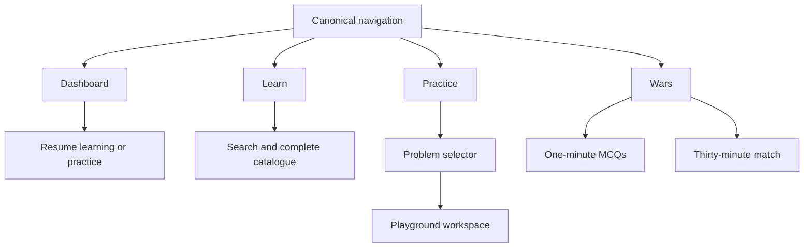

## Context

The application already has a canonical navigation data model and a polished dark workbench language, but six primary destinations, thirteen browse links, persistent status strips, and dense entry pages expose the internal product map before a learner has chosen a task. Existing routes and feature implementations are mature and must remain stable. The active Software Wars change also adds new practice capability that should be integrated without becoming another permanent peer destination.

## Goals / Non-Goals

**Goals:**

- Preserve the current visual identity, route contracts, and learning mechanics.
- Make Today, Practice, and Software Wars answer “what should I do next?” before “what exists?”.
- Establish one four-item primary navigation model across React and generated public pages.
- Give active workspaces a quieter shell while retaining account controls and escape routes.
- Reduce initial visible choices and containers without deleting functionality.

**Non-Goals:**

- Redesigning every content/detail page or replacing the visual design system.
- Renaming routes, changing authentication, altering curriculum data, or changing ranked/game behavior.
- Removing advanced tools, diagnostics, history, or configuration.
- Adding dependencies, schema changes, or backend endpoints.

## Decisions

### Preserve the visual language and overhaul only information hierarchy

This change uses the design workflow's preserve lane. Typography, color, spacing tokens, control sizes, and the workbench character remain authoritative; simplification comes from fewer simultaneous regions, flatter composition, shorter copy, and progressive disclosure. A full visual-world overhaul was rejected because the owner's feedback explicitly distinguishes polish from complexity.

### Use four intent-level primary destinations

The canonical primary set becomes Dashboard, Learn, Practice, and Wars. Dashboard absorbs the useful resumable state from Today and Progress. Practice becomes the Playground rather than a hub in front of it. Browse retains direct access to every route and every complete catalogue surface, grouped by learner intent rather than one undifferentiated inventory.

### Keep route and catalogue compatibility while changing composition

`/dashboard` becomes the canonical landing route while `/today` continues resolving to it. `/practice` renders the Playground; `/playground` remains a stable alias. `/progress` and detailed catalogues remain directly addressable. Search and selectors are backed by canonical arrays and parity tests, so simplification cannot silently remove content or make it discoverable only through an exact query.

### Give each destination one product job

Dashboard resumes and orients. Learn searches and teaches at a high level. Practice is the workbench and selects a problem in place. Wars presents only one-minute and thirty-minute entry choices. Analytics, exhaustive inventories, diagnostics, and history remain supporting views rather than peer decisions.

### Track recent destinations locally without changing persistence contracts

Layout records a bounded, deduplicated list of recent meaningful routes in local storage. Dashboard uses it as navigation memory. This remains guest-safe and does not introduce a backend migration; authenticated mastery, drill, artifact, and profile stores remain authoritative for learning state.

### Load canonical drills directly into Playground

The problem selector searches all canonical practice items. Internal editorial drills hydrate the existing problem panel and concept context. External metadata problems remain visible and open their canonical external target. `/practice/all` remains the explicit browse-all inventory and compatibility surface.

### Derive focused shell state from route semantics

Layout classifies active routes centrally. Battle instances, Playground, drill workspaces, and active Systems Labs suppress DigestBanner, setup/storage strips, and the floating feedback control. SiteHeader switches to a compact focus variant with product identity, an exit destination, settings, and account access. Setup and result/index pages keep the standard shell.

### Prefer native disclosure over new interaction machinery

Optional regions use semantic `details`/`summary` where possible. This keeps keyboard behavior, no-JavaScript semantics, and implementation cost predictable. Tabs or modals are reserved for existing workflows that already require them.

## Risks / Trade-offs

- **Secondary tools may feel less discoverable** → Practice and grouped Browse both expose them, and direct routes remain stable.
- **Path-based focus classification can hide chrome on the wrong state** → Restrict focused mode to explicit active-route patterns and cover them with route tests.
- **Today recommendations may be unavailable for a caught-up learner** → Provide one clear fallback action into Learn, with alternate paths disclosed.
- **Generated navigation may drift** → Continue generating from the canonical data model and extend the existing parity test to enforce four primary items.
- **Broad UI edits can collide with the active Software Wars worktree** → Keep changes additive and localized, preserving all Wars behavior and tests.

## Migration Plan

1. Update canonical navigation classification and generator tests without changing destination URLs.
2. Add standard/focus shell variants and verify route classification.
3. Distill Today, Practice, and Software Wars in isolated commits/check groups.
4. Regenerate public navigation outputs, run route/component/E2E checks, then run the full repository gate.
5. Roll back by restoring the prior canonical primary classification and page composition; no data or backend rollback is required.
